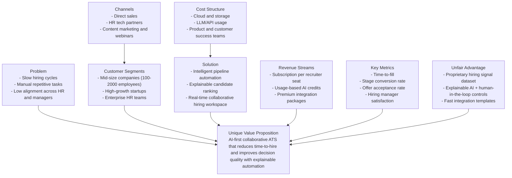
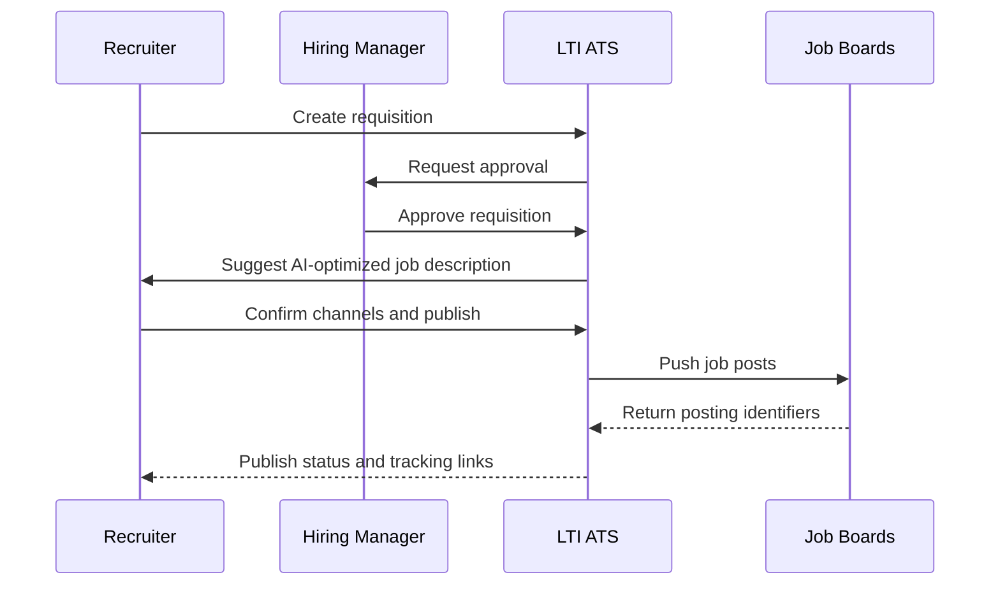
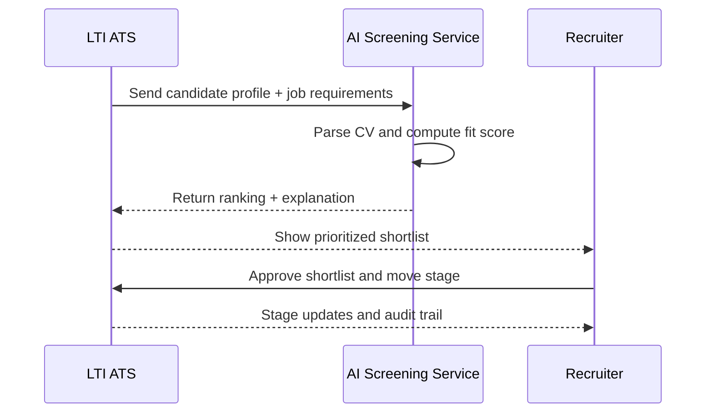
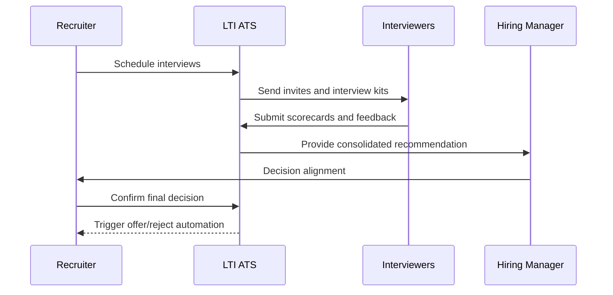
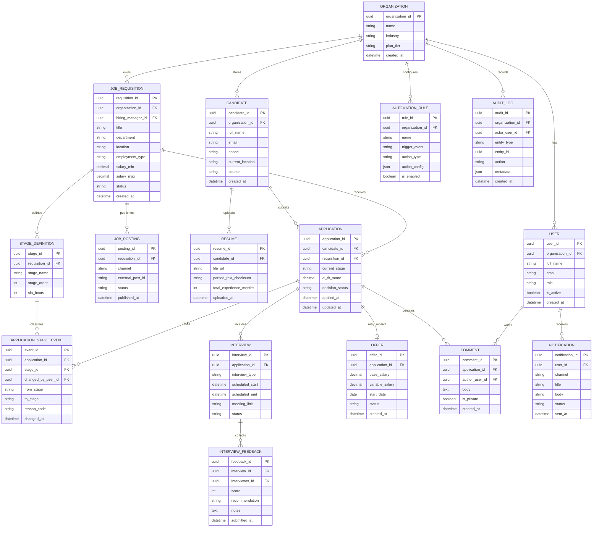
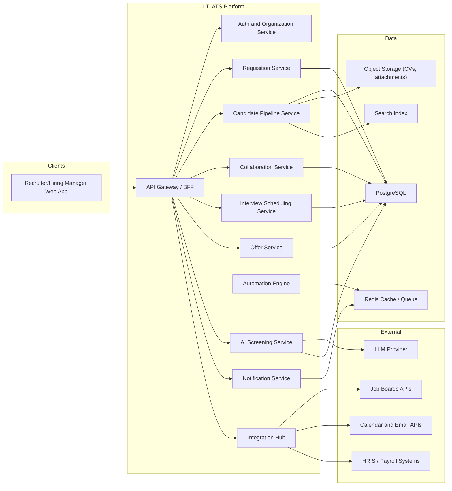
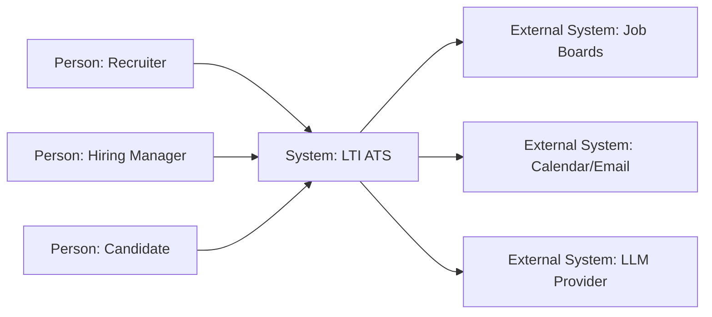
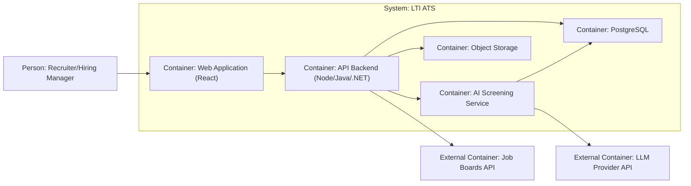
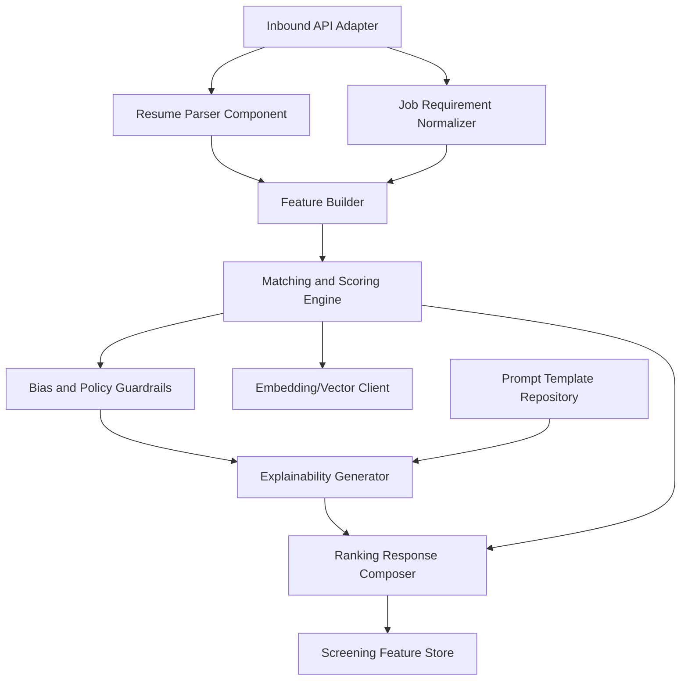

# LTI ATS v1 - Product and System Design

## 1. Product Definition

### 1.1 Brief Description
LTI ATS is an AI-native applicant tracking system for recruiting teams that want to hire faster without losing quality.  
The first version focuses on three outcomes:
- Reduce time-to-fill through automation and AI-assisted screening.
- Improve hiring quality through structured evaluation and explainable rankings.
- Improve team alignment through real-time collaboration between recruiters and hiring managers.

### 1.2 Value Added and Competitive Advantages
- AI copilot across the full hiring funnel, not only resume ranking.
- Real-time collaborative workflows with comments, shared scorecards, and decision history.
- Automation engine for repetitive HR tasks (status changes, reminders, interview logistics).
- Explainable AI recommendations with transparent scoring factors and audit logs.
- API-first integration model for job boards, calendars, email, and HRIS platforms.

### 1.3 Main Functions (v1 Scope)
- Job requisition creation, approval, and publication to external job boards.
- Candidate intake from multiple channels and unified applicant profile.
- AI-assisted CV parsing, skill extraction, candidate-job matching, and shortlist proposals.
- Pipeline management with configurable stages and SLA alerts.
- Interview scheduling with calendar sync and interview kit distribution.
- Structured feedback, hiring scorecards, and final decision workflow.
- Offer generation and status tracking.
- KPI dashboards: time-to-hire, conversion by stage, source quality, and interviewer turnaround.

### 1.4 Lean Canvas Diagram

## 2. Three Main Use Cases

### UC-01: Create and Publish a Job Requisition
**Primary actors:** Recruiter, Hiring Manager  
**Goal:** Publish a validated job opening to selected channels with minimum manual steps.

**Main flow**
1. Recruiter creates a new requisition with role details, required skills, and budget range.
2. System routes requisition to Hiring Manager for approval.
3. Hiring Manager reviews and approves (or requests edits).
4. ATS generates optimized job ad copy (AI suggestion).
5. Recruiter selects channels (company site, job boards, social).
6. ATS publishes and tracks posting IDs and delivery status.

**Postconditions**
- Job requisition is approved and published.
- Pipeline stages are initialized.
- Source tracking is enabled for inbound candidates.

### UC-02: AI-Assisted Screening and Shortlisting
**Primary actors:** Recruiter  
**Goal:** Prioritize candidates using explainable AI while keeping human control.

**Main flow**
1. Candidate applications enter the pipeline.
2. ATS parses resumes and extracts structured signals (skills, experience, certifications).
3. AI Screening Service computes fit score per candidate-job pair.
4. System generates explanation cards and risk flags.
5. Recruiter reviews ranked list and confirms shortlist.
6. Selected candidates move to interview stage.

**Postconditions**
- Shortlist is created with explainable rationale.
- Rejected or parked candidates are documented with reason codes.

### UC-03: Collaborative Interview and Hiring Decision
**Primary actors:** Recruiter, Interviewers, Hiring Manager  
**Goal:** Run structured interviews and reach a decision quickly with full transparency.

**Main flow**
1. Recruiter schedules panel interview slots.
2. ATS sends calendar invites and interview kits.
3. Interviewers submit structured feedback and scorecards.
4. ATS aggregates feedback and highlights disagreements.
5. Hiring Manager and Recruiter run decision review.
6. ATS records decision (offer/reject/talent pool) and triggers next actions.

**Postconditions**
- Decision is recorded with traceable evidence.
- Offer workflow starts automatically for approved candidates.

## 3. Data Model

### 3.1 Entity and Attribute Model

### 3.2 Relationship Notes
- One candidate can apply to multiple requisitions.
- Each application belongs to exactly one requisition and one candidate.
- Pipeline history is stored as immutable stage events for traceability.
- Offer is optional and only created for approved applications.
- Audit logs are cross-cutting and capture sensitive changes for compliance.

## 4. High-Level System Design

### 4.1 Architecture Explanation
LTI ATS v1 follows a modular, API-first architecture:
- **Client layer:** Recruiter and Hiring Manager web app with role-based UI.
- **API layer:** Single entry point for auth, validation, rate limits, and routing.
- **Domain services:** Requisition, Candidate Pipeline, Collaboration, Interview Scheduling, Offers, Notifications.
- **AI services:** Resume parsing, matching, ranking, and explanation generation.
- **Automation layer:** Event-driven rules engine for status transitions and reminders.
- **Data layer:** PostgreSQL for transactional data, object storage for resumes, cache for sessions/jobs, search index for fast candidate lookup.
- **Integration layer:** Job boards, calendar/email providers, HRIS connectors, and LLM provider.

### 4.2 High-Level Architecture Diagram

## 5. C4 Diagram Deep Dive

### 5.1 Target Component
Selected component: **AI Screening Service** (critical for differentiation and hiring efficiency).

### 5.2 C4 Level 1 - System Context

### 5.3 C4 Level 2 - Container View

### 5.4 C4 Level 3 - Component View (Inside AI Screening Service)

### 5.5 Component Responsibilities
- **Resume Parser:** Extracts structured candidate signals from CV files.
- **Job Requirement Normalizer:** Converts requisition text into weighted requirement vectors.
- **Feature Builder:** Creates model-ready features from candidate and job inputs.
- **Matching and Scoring Engine:** Computes fit scores and ranking confidence.
- **Bias and Policy Guardrails:** Applies fairness checks and business constraints.
- **Explainability Generator:** Produces human-readable reasons behind ranking.
- **Ranking Response Composer:** Returns shortlist output to the Pipeline Service.

## 6. v1 Delivery Notes
- Multi-tenant boundaries are enforced at organization level across all entities.
- Human decision remains final for all hiring outcomes (AI is assistive, not autonomous).
- Architecture is designed to support future modules (referral, onboarding, internal mobility).
